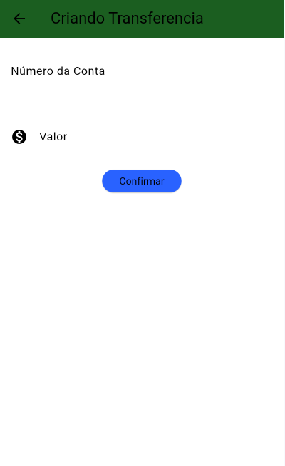
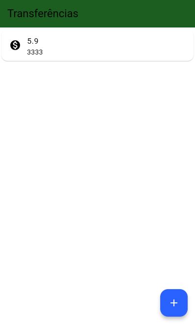

Aplicativo de Transferências Bancárias
Este é um aplicativo prático e eficiente, projetado para facilitar transferências bancárias de forma rápida e segura. Com uma interface intuitiva, ele permite aos usuários:
- Adicionar informações bancárias, como número da agência.
- Especificar o valor da transferência.
- Realizar transferências com rapidez e segurança.
- Gerenciar e visualizar o histórico de transações realizadas.

O aplicativo foi desenvolvido com foco em usabilidade e segurança, utilizando boas práticas para proteger os dados dos usuários e garantir uma experiência fluida em dispositivos móveis. Ele é ideal para quem precisa organizar suas finanças e realizar transferências diretamente pelo celular.

