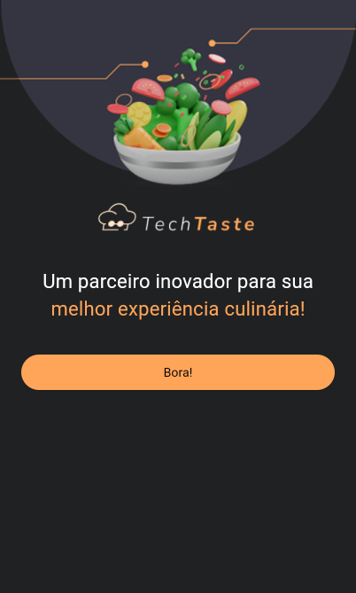
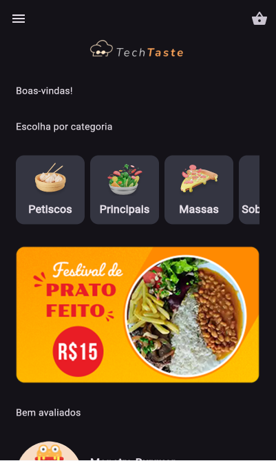
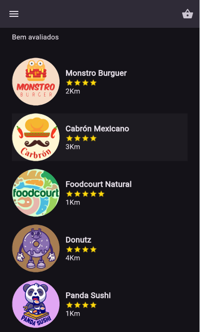
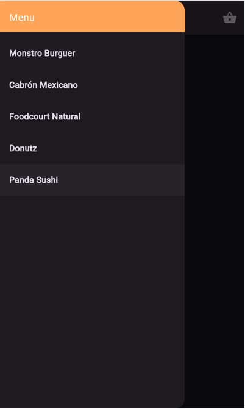
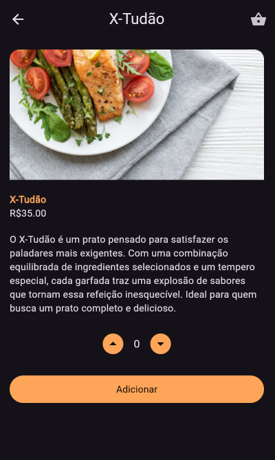
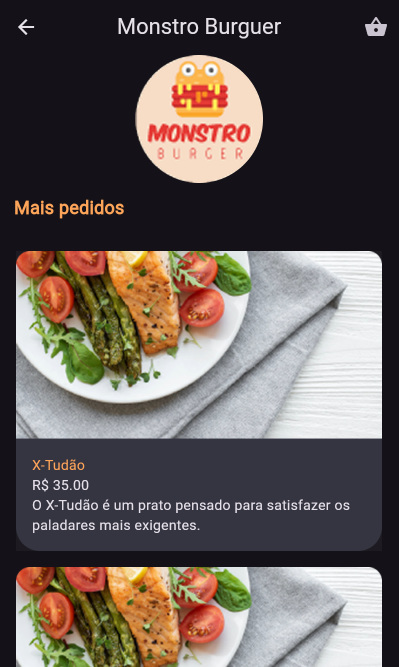
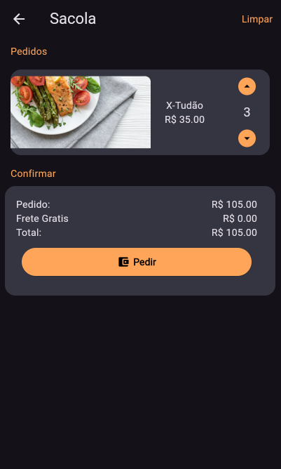

Aplicativo de Pedido de Comida
Este projeto é um aplicativo desenvolvido durante a Imersão Alura, com o objetivo de criar uma solução prática para pedidos de comida. O app oferece uma interface amigável e intuitiva, permitindo que os usuários:
- Naveguem por um cardápio diversificado.
- Personalizem seus pedidos de acordo com suas preferências.
- Realizem o pedido com poucos cliques.

Funcionalidade Especial: Para pedidos iguais ou superiores a R$100, o frete é gratuito, incentivando compras maiores e proporcionando benefícios ao cliente.
O aplicativo foi construído utilizando Flutter, garantindo desempenho nativo tanto em Android quanto em iOS, e priorizando uma experiência fluida para o usuário.

